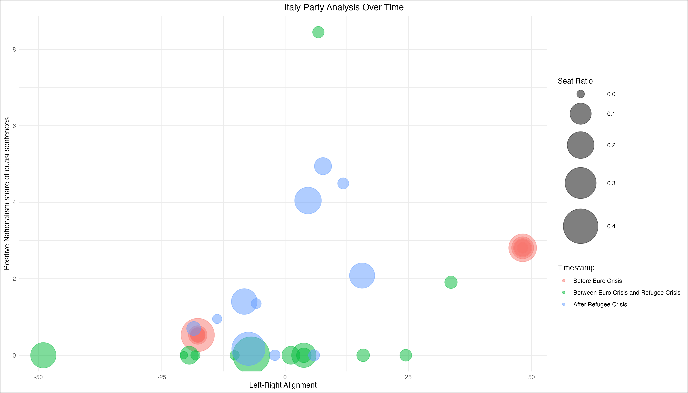
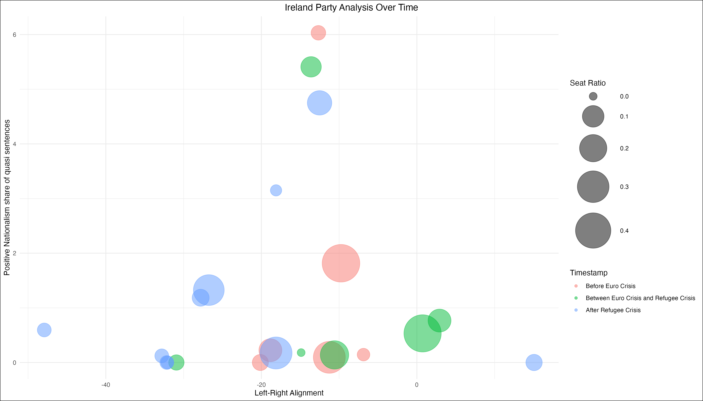

```{r}
library(readr)
library(dplyr)
library(ggplot2)
library(ggrepel)
manifesto_data <- read_csv("MPDataset_MPDS2023a.csv")
```
### Goal: 
To investigate the effect of (successive) crises on nationalist sentiment in party manifestos in European Union member countries

### Problem and Significance

In times of crisis, populist parties especially react with nationalist rhetoric to gain voters. In the European Union, this manifests in the form of advocating for less cooperation on the European level or even arguing for leaving the European Union altogether. Mainstream parties may try to incorporate more nationalist rhetoric in their party manifestos as well as a result, and so if crises cause a rise in nationalism across the political spectrum, times of crisis should give concern that European cooperation could decrease in times when is needed the most.

Successive crises have become an increasing point of concern especially in recent years (for example, COVID-19, Inflation and the war in Ukraine). Thus, having insight into whether and under which circumstances parties will react to these crises with increased nationalism is more important than ever, especially since Euro-sceptic, nationalist parties are forming governments and gaining seats in an increasing number of member states.

### Chosen cases: 
We chose **Euro crisis** and **Refugee Crisis** as most recent instances of successive crises that the Manifesto Project offered data for.

To differentiate between the effects of these two crises as well as their interaction effect, we chose to compare one country that experienced major struggles due to both (Greece), and two countries that only experienced one of the two (Ireland for the Euro crisis, Sweden for the refugee crisis).

**Italy**: was one of the countries hit hardest during the Euro crisis and as a Mediterranean state is also one of the member states that are the first point of contact for refugees when they arrive in the EU

**Ireland**: was impacted by Euro crisis but is not part of the Relocation Agreement of the EU and is therefore a rare case of a country that experienced major effects of the Euro crisis but was not affected by the refugee crisis as much as most other member states

**Sweden**: was not affected by Euro crisis as it is not in the Euro zone but had the highest number of refugees per capita during the refugee crisis

### Time stamps:
For each country, three time stamps were chosen from which all available party manifestos were used for analysis. These time stamps were chosen according to the following criteria: The **first time stamp** marks the last manifesto available before the Euro crisis started to measure the base level of national sentiment in the manifestos, which is either in 2006 or 2007. The **second time stamp** was chosen to best reflect the effect of the Euro crisis, which means the first available manifesto after the start of the Euro crisis was used. The **third time stamp** is the first available manifesto after the onset of the refugee crisis, either 2018 or 2016 in our cases. The exact time stamps differ between the countries since publishing date of the manifestos depends on the date of national election.

First country of comparison, Sweden:
```{r, eval = FALSE}
# data extraction for Sweden
sweden_desired_dates <- c(200609, 201409, 201809)
sweden_filtered_data <- manifesto_data %>%
  filter(countryname == "Sweden", date %in% sweden_desired_dates) %>%
  select(partyname,date,per601,rile,absseat,totseats) %>%
  mutate(seat_ratio = absseat/totseats)
sweden_filtered_data

# bubble plot for Sweden
ggplot(sweden_filtered_data, aes(x = rile, y = per601, size = seat_ratio, color = as.factor(date))) + 
    geom_point(alpha = 0.5) +
    scale_size_continuous(range = c(5, 25),
                          name = "Relative number of seats in parliament") +  # Enlarge the range for bubble sizes
    scale_color_discrete(
    name = "Timestamp",  # Adjust the color legend title
    labels = c(
      "Before Euro Crisis", "Between Euro Crisis and Refugee Crisis", "After Refugee Crisis")  # Adjust the color legend
    ) +
    labs(
        title = "Sweden Party Analysis Over Time", 
        x = "Left-Right Alignment", 
        y = "Positive Nationalism share of quasi sentences", 
        color = "Manifesto Time",
        size = "Seat Ratio"
    ) +
    theme_minimal() +
    theme(legend.position = "right", 
          plot.title.position = "plot", 
          plot.background = element_rect(fill = "white")) + 
    guides(color = guide_legend(title = "Timestamp"), size = guide_legend(title = "Seat Ratio")) +
    theme(plot.title = element_text(hjust = 0.5))

# Save the plot with increased width for better label fit
ggsave("sweden_party_analysis_wide.png", width = 14, height = 8)
```


**Interpretation**: Prior to the onset of the euro and refugee crises, the prevalence of positive nationalism in Sweden's party manifestos, as represented in quasi sentences, was relatively minimal. Interestingly, in the aftermath of the euro crisis, an increase in the expression of positive nationalism became evident, although Sweden was not severly affected by the euro crisis. This trend was further amplified following the refugee crisis, indicating a significant surge in the affirmative references to nationalism within the political narrative.


Second country of comparison, Italy:
```{r, eval = FALSE}
# data extraction for Italy
italy_desired_dates <- c(200604, 201302, 201803)
italy_filtered_data <- manifesto_data %>%
  filter(countryname == "Italy", date %in% italy_desired_dates) %>%
  select(partyname,date,per601,rile,absseat,totseats, progtype) %>%
  mutate(seat_ratio = absseat/totseats) %>%
  na.omit() # omit rows with NA values
italy_filtered_data

# bubble plot for Italy
ggplot(italy_filtered_data, aes(x = rile, y = per601, size = seat_ratio, color = as.factor(date))) + 
    geom_point(alpha = 0.5) +
    scale_size_continuous(range = c(5, 25)) +  # Enlarge the range for bubble sizes
    scale_color_discrete(
    name = "Timestamp",  # Adjust the color legend title
    labels = c(
      "Before Euro Crisis", "Between Euro Crisis and Refugee Crisis", "After Refugee Crisis")  # Adjust the color legend
    ) +
    labs(
        title = "Italy Party Analysis Over Time", 
        x = "Left-Right Alignment", 
        y = "Positive Nationalism share of quasi sentences", 
        color = "Manifesto Time",
        size = "Seat Ratio"
    ) +
    theme_minimal() +
    theme(legend.position = "right", 
          plot.title.position = "plot", 
          plot.background = element_rect(fill = "white")) + 
    guides(color = guide_legend(title = "Timestamp"), size = guide_legend(title = "Seat Ratio")) +
    theme(plot.title = element_text(hjust = 0.5))

# Save the plot with increased width for better label fit
ggsave("italy_party_analysis_wide.png", width = 14, height = 8)
```


**Interpretation**: In Italy, the discussion of positive nationalism within party manifestos has shown a notable evolution over time. Before the euro crisis, such expressions were almost non-existent, except for some extreme right parties. However, a gradual increase in positive nationalism references is observed between the euro crisis and the refugee crisis, even for some central-right parties. This uptick becomes even more pronounced after the refugee crisis, suggesting a shift towards more frequently mentioning nationalism in a positive light by Italian political parties.


Third country of comparison, Ireland:
```{r, eval = FALSE}
# data extraction for Ireland
ireland_desired_dates <- c(200705, 201102, 201602)
ireland_filtered_data <- manifesto_data %>%
  filter(countryname == "Ireland", date %in% ireland_desired_dates) %>%
  select(partyname,date,per601,rile,absseat,totseats) %>%
  mutate(seat_ratio = absseat/totseats) %>%
  na.omit() # omit rows with NA values
ireland_filtered_data

# Socialist party was omitted for Ireland in 2011 because of missing number of seats

# bubble plot for Ireland
ggplot(ireland_filtered_data, aes(x = rile, y = per601, size = seat_ratio, color = as.factor(date))) + 
    geom_point(alpha = 0.5) +
    scale_size_continuous(range = c(5, 25)) +  # Enlarge the range for bubble sizes
    scale_color_discrete(
    name = "Timestamp",  # Adjust the color legend title
    labels = c(
      "Before Euro Crisis", "Between Euro Crisis and Refugee Crisis", "After Refugee Crisis")  # Adjust the color legend
    ) +
    labs(
        title = "Ireland Party Analysis Over Time", 
        x = "Left-Right Alignment", 
        y = "Positive Nationalism share of quasi sentences", 
        color = "Manifesto Time",
        size = "Seat Ratio"
    ) +
    theme_minimal() +
    theme(legend.position = "right", 
          plot.title.position = "plot", 
          plot.background = element_rect(fill = "white")) + 
    guides(color = guide_legend(title = "Timestamp"), size = guide_legend(title = "Seat Ratio")) +
    theme(plot.title = element_text(hjust = 0.5))

# Save the plot with increased width for better label fit
ggsave("ireland_party_analysis_wide.png", width = 14, height = 8)

```


**Interpretation**: The data indicates that positive nationalism was already a topic of some discussion in Irish political narratives before the crises. However, following the euro crisis, there's a noticeable shift with more parties leaning towards the right. After the refugee crisis, we observe a significant move to the extreme-right by one party. Despite these shifts in political positioning, the overall mentions of positive nationalism in party manifestos do not show a drastic increase. This could suggest that Ireland's experience with the refugee crisis didn't profoundly alter the prevalence of positive nationalism in party rhetoric as compared to other factors.

